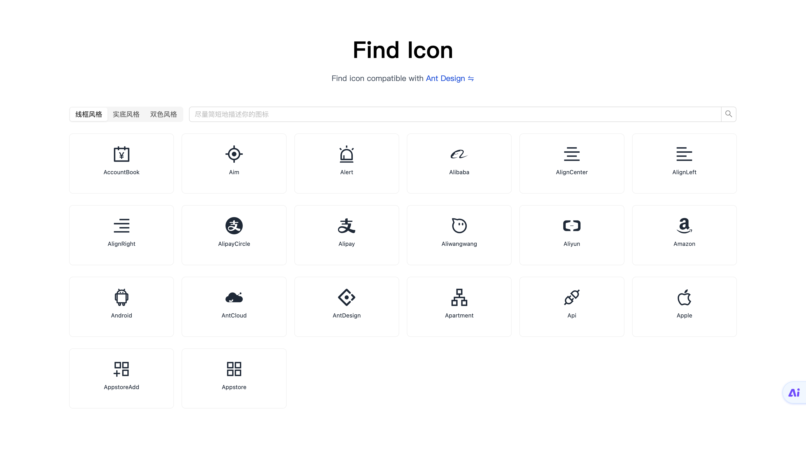

# Find Icon

快速找到符合需求的 UI 库配套图标，基于扣子工作流+知识库，已支持 Ant Design、Ant Design Mobile、Material UI。

## Why me?

在日常开发过程中，经常需要在指定 UI 库的配套图标库中寻找图标，但由于图标数量众多，且我们需要寻找的图标往往是基于某个业务需求，如：评估，订单，用户等，此时我们的思路是，将需求翻译成英文，如 "订单" => "Order"，并尝试去图标库中通过文字匹配搜索 "Order"，但一个图标往往可能对应着多种含义或表达，导致有时明明存在符合需求的图标，却无法找到，那么有没有一种方式，我们可以直接通过输入需求，就能找到相关的图标呢？

没错，这就是此项目的目标，利用语义匹配和精确匹配等方式，通过 AI 智能搜索，快速找到符合需求的图标。

## 技术栈

- React V18
- TypeScript V5
- TailwindCSS V3
- Pure React Router V0
- Ant Design V5
- AHooks V3
- PNPM V8
- Rsbuild V1
- Jest V29

## 站点截图

